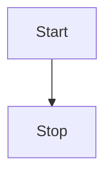

# @tracelessdream/vitepress-plugin-mermaid

Add mermaid support for Vitepress.
It detects any dark theme that are set in body as long as it has dark in the name

See the [docs 📕](https://emersonbottero.github.io/vitepress-plugin-mermaid/)  
and a [complex example 😎](https://emersonbottero.github.io/vitepress-plugin-mermaid/guide/more-examples.html#render)

## Install

npm
```bash
npm i @tracelessdream/vitepress-plugin-mermaid mermaid -D
```
pnpm
```bash
pnpm add @tracelessdream/vitepress-plugin-mermaid mermaid -D
```

## Features

- **Lightbox preview** — Click any diagram to open a full-screen preview overlay
- **Zoom in / out** — Use toolbar buttons or mouse scroll wheel to zoom the diagram
- **Pan** — Drag to pan around the diagram
- **Download SVG** — One-click download of the rendered diagram as an SVG file
- **Theme aware** — Automatically re-renders when switching between light/dark mode

## Setup it up

Add wrapper

```js
// .vitepress/config.js
import { withMermaid } from "@tracelessdream/vitepress-plugin-mermaid";

export default withMermaid({
  // your existing vitepress config...
  mermaid:{
    //mermaidConfig !theme here works for light mode since dark theme is forced in dark mode
  },
  ...
});
```

Use in any Markdown file

````md
<!---any-file.md-->


````

## Preview & Interaction

Click any rendered diagram to open the lightbox preview:

- **Zoom**: Use the toolbar **+ / −** buttons, or scroll with your mouse wheel / trackpad
- **Pan**: Click and drag to move the diagram around
- **Reset**: Click the reset button to restore the original view
- **Download**: Click the download button to save the diagram as an `.svg` file
- **Close**: Press `Esc` or click the × button
