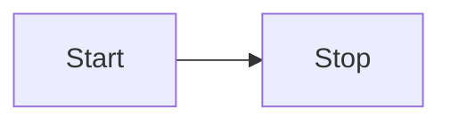

# Getting Started

This section will help you add mermaid support for VitePress.

## Install

```bash
npm i @tracelessdream/vitepress-plugin-mermaid mermaid -D
```

With pnpm:

```bash
pnpm add @tracelessdream/vitepress-plugin-mermaid mermaid -D
```

The plugin supports standard pnpm installation and does not require
`--shamefully-hoist`.

## Setup it up

Add wrapper

```js
// .vitepress/config.js
import { withMermaid } from "@tracelessdream/vitepress-plugin-mermaid";

export default withMermaid({
    // your existing vitepress config...
    // optionally, you can pass MermaidConfig
    mermaid: {
      // refer https://mermaid.js.org/config/setup/modules/mermaidAPI.html#mermaidapi-configuration-defaults for options
    },
    // optionally set additional config for plugin itself with MermaidPluginConfig
    mermaidPlugin: {
      class: "mermaid my-class", // set additional css classes for parent container 
    },
});
```

Code with ```mmd

```mmd
flowchart LR
  Start --> Stop
```

Visualize with ```mermaid



## Preview and Interaction

Click a rendered diagram to open the preview. The preview supports:

- Zooming with the `+` and `-` buttons or the mouse wheel
- Panning by dragging the diagram
- Resetting the view to fit the current window
- Downloading the rendered diagram as an SVG file
- Closing with `Esc` or the close button
